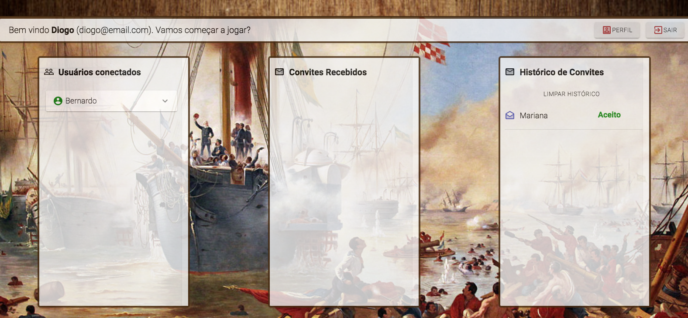
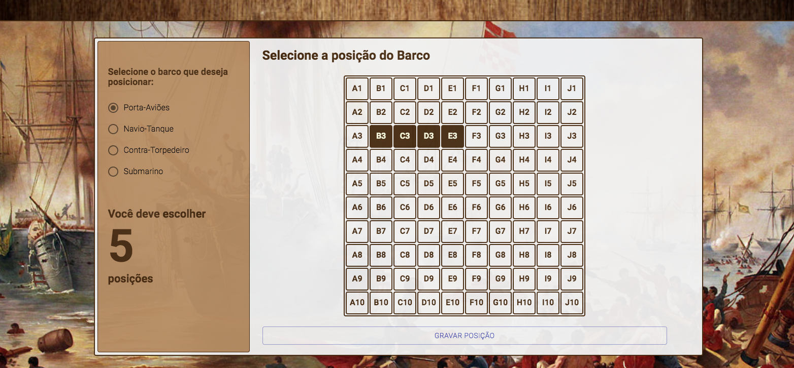
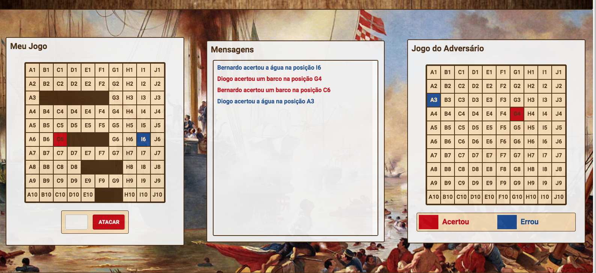

## Batalha naval

Jogo de batalha naval multi-player criado para aprendizado de Socket.io e ReactJS.

- Front End => ReactJS
- Back End Socket => NodeJS [Link do Projeto](https://github.com/diogorolins/new-battleship-socket)
- Back End Rest => Java Spring Boot [Link do Projeto](https://github.com/diogorolins/new-battleship-backend)

[Jogar - Link do Jogo](http://batalhanaval.diogorolins.com.br)

  

  

  

